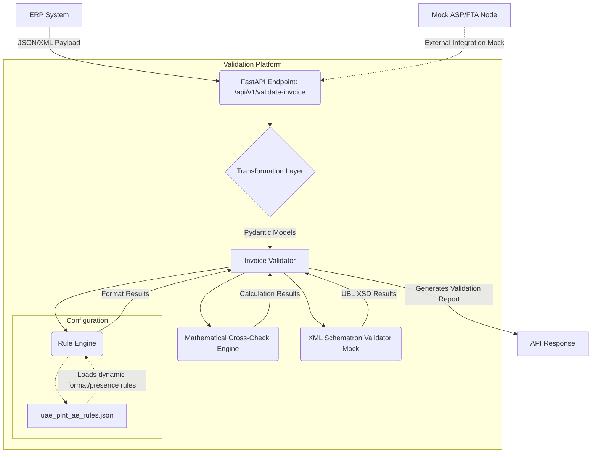

# Architecture Diagram for UAE E-Invoicing Engine

## System Layers
1. **Input Layer**: Handles generic JSON/XML payloads coming from the ERP Adapters.
2. **Transformation Layer**: Maps data to the core standardized schema.
3. **Core Engine (Validator)**: The brain of the POC holding hardcoded logic (Cross Checks).
4. **Rule Engine**: Loads runtime configuration for 51 PINT mandatory rules (presence, regex).
5. **ASP Mock**: Allows E2E integration testing to simulate response from actual Tax APIs.
